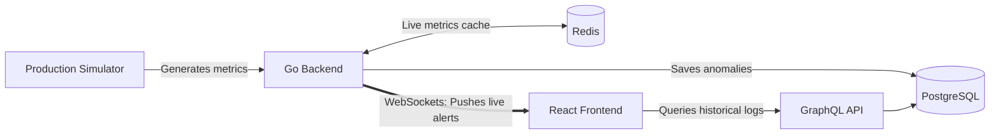

# Sticker Mule Production Dashboard

A real-time, full-stack IoT monitoring system built to demonstrate proficiency with the core tech stack used at Sticker Mule.

This project simulates a production environment (monitoring Digital Printers, Die-Cutters, and the Mule Sauce line) and provides a live dashboard to track metrics and detect anomalies in real-time.

## Why this project?

I built this specific dashboard to showcase my hands-on experience with **Go, React, GraphQL, PostgreSQL, Redis, and Docker** — the exact technologies powering Sticker Mule's infrastructure. It demonstrates architectural patterns like caching, event-driven WebSocket communication, and graceful service initialization.

## System Architecture



## Tech Stack & Key Features

- **Backend:** Go (Golang)
  - Robust graceful initialization (Retry mechanism for DB connection).
  - WebSockets for real-time, bi-directional event pushing.
  - Custom GraphQL server setup for querying historical data.
  - REST endpoint for fetching immediate cached metrics.
- **Frontend:** React + TypeScript + Recharts + React-Toastify
  - Real-time graphs updating automatically without polling.
  - Instant Toast alerts when an anomaly is detected (e.g., Mule Sauce overheating).
- **Databases:** \* **PostgreSQL:** Relational data storage for anomaly logs (accessed via GORM).
  - **Redis:** Key-value store for hot, high-throughput machine metrics.
- **Infrastructure:** Docker & Docker Compose
  - Fully containerized multi-container setup.

## Quick Start

You don't need to install Node, Go, or databases locally. As long as you have Docker running, you can spin up the entire factory in one command.

1. Clone the repository:

   ```bash
   git clone https://github.com/AndriiBurii/factory_iot
   cd factory_iot
   ```

2. Spin up the infrastructure:

   ```bash
   docker-compose up --build
   ```

3. Open your browser:
   - **Live Dashboard:** [http://localhost](http://localhost)
   - **GraphQL API Endpoint:** `http://localhost:8080/graphql`
     _(Note: This is a POST-only endpoint. You can test it by sending a query like `{"query": "{ anomalies { machineId value } }"}` via PowerShell, Postman or cURL)._

## What to look out for in the UI?

- Watch the charts update in real-time.
- Wait for a random anomaly to trigger (e.g., Printer paper jam or Die-Cutter pressure drop). You will instantly see a **UI Alert** in the top right corner, pushed directly from the Go backend via WebSockets.
